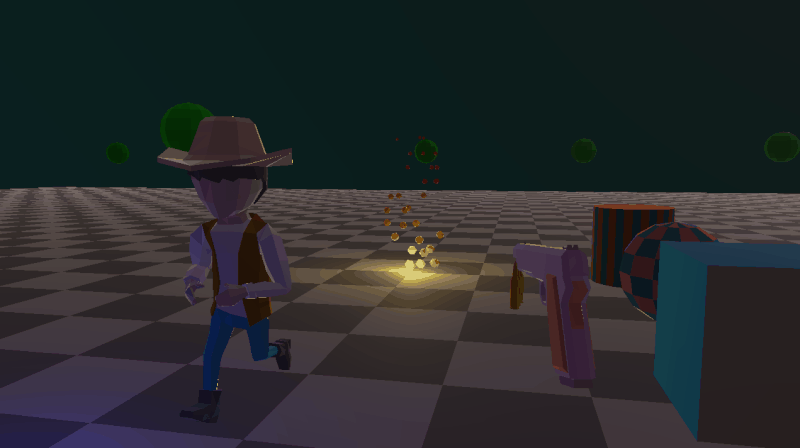
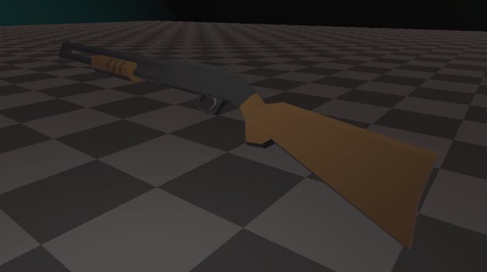
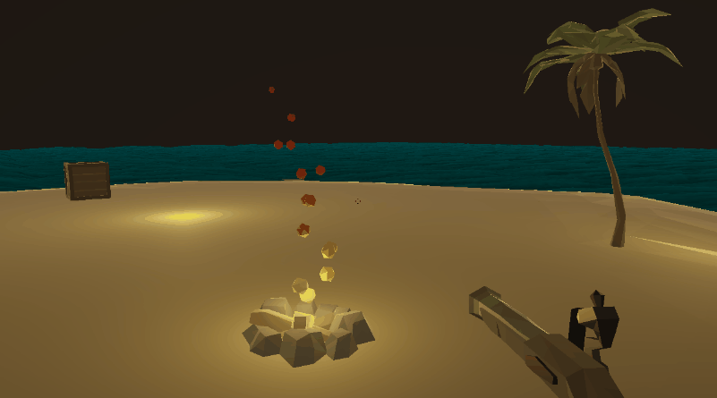
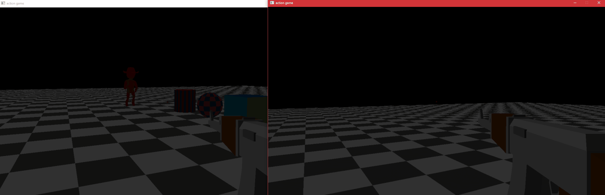

# action-game

i'm not sure what this repo will end up being.
for now, it's just a place where i have fun programming

### Animations
instead of traditional animation, a library of poses is used
with different interpolation techniques to add impact and fidelity.

### Particle System
simple but versitile particle system that is capable of basic effects
like fire, explosions, blood spurts, etc. it supports wind and physics as well.

### Multiplayer
nothing special here, just a basic multiplayer implementation 
that sends position & orientation data over tcp every few miliseconds.

### Credits
- programmer : Me
- art : some assets were purchased form the incredibly talanted folks at syntystudios