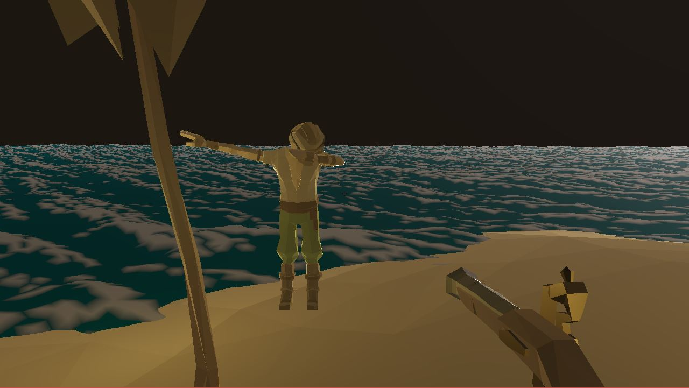

# pirate-game [WIP]

### Animations
instead of traditional animation, a library of poses is used
with different interpolation techniques to add impact and fidelity.

### Particle System
simple but versitile particle system that is capable of basic effects
like fire, explosions, blood spurts, etc. it supports wind and physics as well.

### Water
ocean water waves are generated with fast fourier transforms. i still have alot
of learning to do in this area, so it looks a little rough at the moment.

### Multiplayer
nothing special here, just a basic multiplayer implementation 
that sends position data over tcp every few miliseconds.

### Credits & Extras
- programming : Me
- art : some assets were purchased form the incredibly talanted folks at Synty Studios
- more info about how this project came to be can be read in the journal